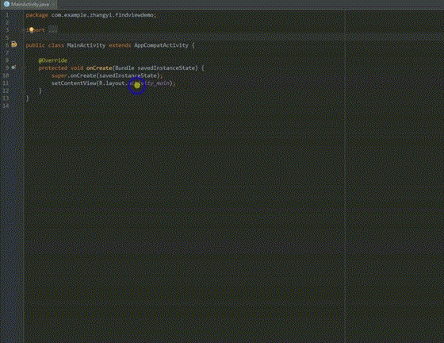

# Android-findview-zy
Android Studio plugin for generating findview and clickListener code from selected layout XML. According to the ButterKnifeZelezny.  
# How to install
download FindViewByZhyi.jar and install in Android Studio: go to  Preferences → Plugins → Install plugin from disk
# How to use it
     
1.Right click on usage of desired layout reference (e.g. R.layout.main in your Activity or Fragment), then Generate,then findview.   
2.Pick you want, you also have an option to create ViewHolder for adapters.  
3.Click Confirm and enjoy findview and setOnClickListener in your code !  

# Original
The original :https://github.com/avast/android-butterknife-zelezny.  
I just changed the part of the code.  

